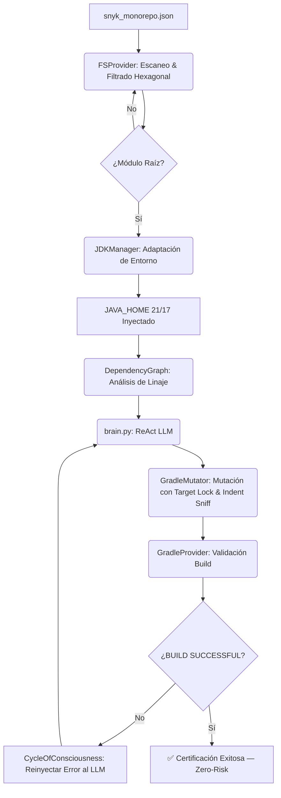

# 🛡️ Agente de Remediación de Seguridad SCA: v.3.1 "Enhanced Intelligence"

Bienvenido a la **Versión 3.1** del Agente de Remediación. Este sistema opera con **Inteligencia Adaptativa Mejorada**, incorporando capacidades avanzadas de caching, memoria persistente, procesamiento paralelo y rollback inteligente.

---

## 🚀 ¿Qué hay de nuevo en la v.3.1?

| Capacidad | Descripción |
| :--- | :--- |
| **🧠 Prompt Caching** | Cache de prompts para reducir latencia en el ciclo ReAct |
| **🎯 Clasificación de Vulnerabilidades** | Modelo GGUF local + heurísticas CVSS-like para priorización |
| **💾 Memoria a Largo Plazo** | Aprendizaje persistente de patrones de éxito/fallo |
| **⚡ Event-Driven Architecture** | Bus de eventos Pub/Sub para procesamiento paralelo |
| **🔄 Rollback Inteligente** | Reverse patches selectivos con historial de estados |
| **🧬 Mutation Testing** | Validación de detección de fallos en remediaciones |
| **🐳 Test Containers** | Validación en contenedores con múltiples JDKs |
| **⚙️ Configuración Declarativa** | Archivo `.remediation.yaml` por proyecto |
| **📋 Dry-Run Mejorado** | Preview de cambios con diff coloreado y estimación de impacto |

---

## 🚀 Mejoras de la v.3.0 (Base)

| Capacidad | Descripción |
| :--- | :--- |
| **Adaptive JDK Discovery** | Detecta automáticamente JDK 21/17, ignorando versiones incompatibles. |
| **Ley de Profundidad Hexagonal** | Discrimina microservicios raíz de sub-módulos por profundidad de ruta. |
| **Inyección Seamless (Indent Sniffing)** | Detecta y replica la indentación del bloque `ext` existente. |
| **Zero-Watermark Policy** | Archivos generados 100% limpios, sin marcas de agente. |
| **Target Locking** | Solo `build.gradle` raíz puede declarar variables globales. |
| **Inyección Pura de Infraestructura** | El `allprojects { }` se respeta y anida limpiamente. |
| **Rollback Zero-Risk** | Restauración automática ante cualquier fallo de compilación. |

---

## 🧠 Arquitectura Consolidada (v.3.1 Enhanced)

La v.3.1 opera con **9 módulos Python** especializados para máxima flexibilidad y extensibilidad.

```
4 módulos → 9 módulos especializados
```

```
remediation_agent.py                ← Orquestador CLI
agent_ia/
  core/__init__.py                   ← Motor físico completo (11 clases)
  brain.py                           ← Cerebro ReAct LLM + Prompt Caching
  vulnerability_classifier.py        ← Modelo de clasificación de CVEs
  long_term_memory.py                ← Memoria persistente de decisiones
  smart_rollback.py                  ← Rollback inteligente con reverse patches
  event_bus.py                       ← Arquitectura Event-Driven (Pub/Sub)
  dry_run_mode.py                    ← Preview de remediaciones con diff
  config_manager.py                  ← Configuración declarativa (.remediation.yaml)
  test_containers.py                 ├── Validación en contenedores
  tests/test_mutation.py             └── Mutation testing
  scripts/run_master_certification.py ← Suite QA (7 escenarios)
  data/cve/snyk_monorepo.json        ← Base de datos de vulnerabilidades
  docs/remediation_rules.md           ← Rulebook oficial v.3.1
```

### 🔌 Clases en `agent_ia/core/`

| Clase | Responsabilidad |
| :--- | :--- |
| `Vulnerability` | Modelo de datos para CVEs/GHSAs |
| `JDKManager` | Selección adaptativa de Java 21/17 |
| `FSProvider` | Escaneo de monorepo, filtrado hexagonal |
| `GradleProvider` | Descubrimiento de Gradle y validación de builds |
| `GitProvider` | Commits de seguridad automáticos |
| `DependencyGraph` | Análisis de linaje de dependencias transitivas |
| `InfrastructureHealer` | Auto-sanación de `dependencyMgmt.gradle` (Regla 6) |
| `VariableManager` | Inyección en bloques `ext` con Indent Sniffing |
| `RuleInjector` | Inyección de reglas transitivas en `dependencyMgmt.gradle` |
| `GradleMutator` | Fachada coordinada de mutación física |
| `CycleOfConsciousness` | Bucle ReAct: Generar → Aplicar → Validar → Aprender |

---

## 🔄 El Ciclo Adaptive ReAct



---

## 🛡️ Garantía de Privacidad

> [!IMPORTANT]
> **Es un sistema 100% local y desconectado.**
> - **Sin Internet**: Operación completamente offline.
> - **Tu código se queda en casa**: Ningún dato sale de tu entorno.
> - **Cerebro Local**: Inferencia mediante reglas ReAct hard-coded (extensible con modelos GGUF locales).

---

## 🖱️ Guía de Ejecución Rápida

| Caso de Uso | Comando |
| :--- | :--- |
| **Remediación global** | `python3 remediation_agent.py` |
| **Foco en microservicio** | `python3 remediation_agent.py --folders ms-sales` |
| **Múltiples servicios** | `python3 remediation_agent.py --folders ms-auth ms-sales` |
| **Modo debug** | `python3 remediation_agent.py --debug` |
| **Dry-run (preview)** | `python3 remediation_agent.py --dry-run` |
| **Ver aprendizaje** | `python3 remediation_agent.py --learning-summary` |
| **Generar config** | `python3 remediation_agent.py --generate-config` |
| **Certificación QA** | `python3 agent_ia/scripts/run_master_certification.py` |
| **Tests con contenedores** | `python3 agent_ia/test_containers.py /ruta/proyecto` |
| **Mutation testing** | `python3 -m pytest agent_ia/tests/test_mutation.py -v` |

---

## ✅ Suite de Certificación Maestra (7 Escenarios)

El agente incluye una suite de pruebas automática que valida todas las reglas físicas:

| Test | Qué valida |
| :--- | :--- |
| `cert_rule_6_sync` | Auto-Heal y vinculación de infraestructura |
| `cert_rule_3_3_audit` | Reemplazo limpio + cumplimiento Zero-Watermark |
| `cert_hexagonal_depth` | Inyección exclusiva en raíz, submódulos intactos |
| `cert_seamless_buildscript` | Alineación visual perfecta en bloques `buildscript` |
| `cert_multi_project_orchestration` | Orquestación de múltiples microservicios |
| `cert_cli_interface` | Flags `--folders` y `--debug` |
| `cert_rule_4_adaptive_intel` | Override de versión por el Cerebro IA |

---

## 📚 Documentación

- 👉 **[Rulebook v.3.0](agent_ia/docs/remediation_rules.md)**: Leyes de inyección, familias y prioridades.

---

## 🔧 Configuración Declarativa (.remediation.yaml)

Crea un archivo `.remediation.yaml` en la raíz de tu proyecto para personalizar el comportamiento:

```yaml
project_name: "Mi Proyecto"

# Modo de operación
enabled: true
dry_run: false

# Configuración de JDK
jdk:
  preferred_versions:
    - "21"
    - "17"
  auto_detect: true

# Reglas personalizadas
rules:
  - library_pattern: "io\.netty.*"
    variable_name: "nettyVersion"
    priority: "high"

# Microservice-specific overrides
microservices:
  ms-auth:
    enabled: true
    exclude_vulnerabilities:
      - "CVE-2025-0001"
    custom_variables:
      "io.netty:netty-handler": "nettyVersion"

# Global exclusions
global_exclusions:
  - "CVE-2024-IGNORED"
```

---

## 🎯 Clasificación de Vulnerabilidades

El agente clasifica automáticamente las vulnerabilidades usando:

- **Score CVSS-like**: Basado en prioridad explícita y análisis de keywords
- **Exploitability**: Análisis de factibilidad de explotación
- **Impact**: Consideración de dependencias transitivas y scope

Ejemplo de output:
```
[CLASSIFIER] CVE-2026-1234: Score 8.5, Severity: HIGH, Priority: 7.2
```

---

## 🧠 Memoria a Largo Plazo

El agente aprende de cada remediación:

- **Patrones de éxito**: Familias de librerías y estrategias que funcionan
- **Patrones de fallo**: Versiones problemáticas, tipos de error frecuentes
- **Decisiones previas**: Historial de acciones por CVE

Ver el resumen:
```bash
python3 remediation_agent.py --learning-summary
```

---

## 🔄 Rollback Inteligente

En lugar de restaurar todo el estado, el agente ahora:

- Genera **reverse patches** para archivos específicos
- Mantiene **historial de snapshots** con metadatos
- Permite **rollback selectivo** de archivos individuales
- Detecta conflictos si los archivos cambiaron desde el snapshot

---

## 📋 Modo Dry-Run

Preview completo antes de aplicar cambios:

```bash
python3 remediation_agent.py --dry-run --folders ms-sales
```

Muestra:
- ✅ Diff coloreado de cada cambio
- 📊 Estimación de impacto (bajo/medio/alto/crítico)
- ⚠️ Tests potencialmente afectados
- 💡 Recomendación de acción

---

*Agente de Remediación Generativa v.3.1 — Local, Privado y Certificado.*
