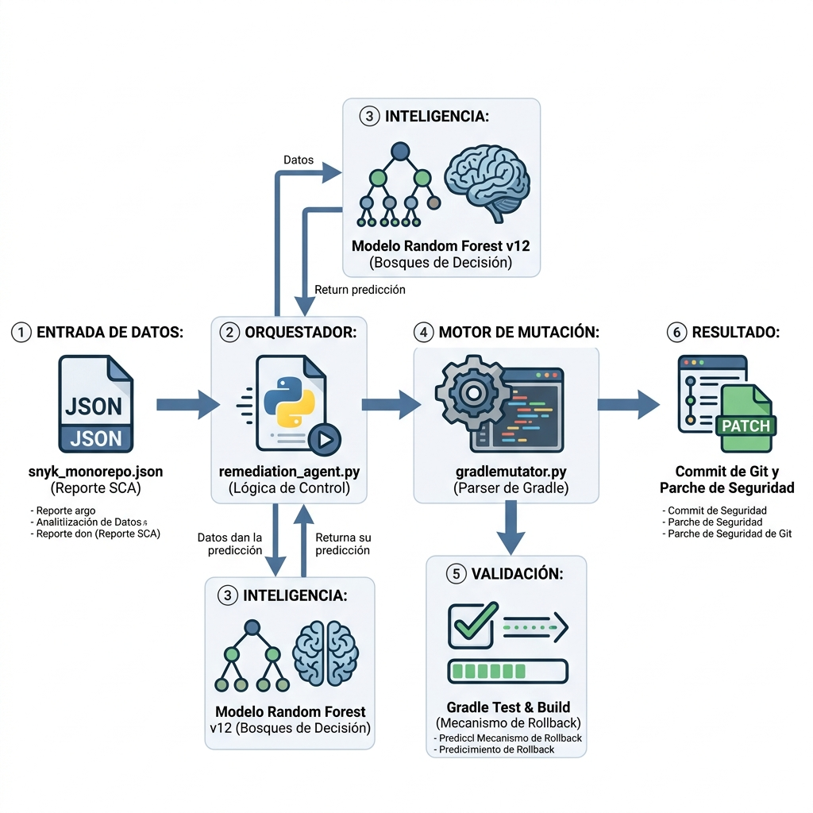
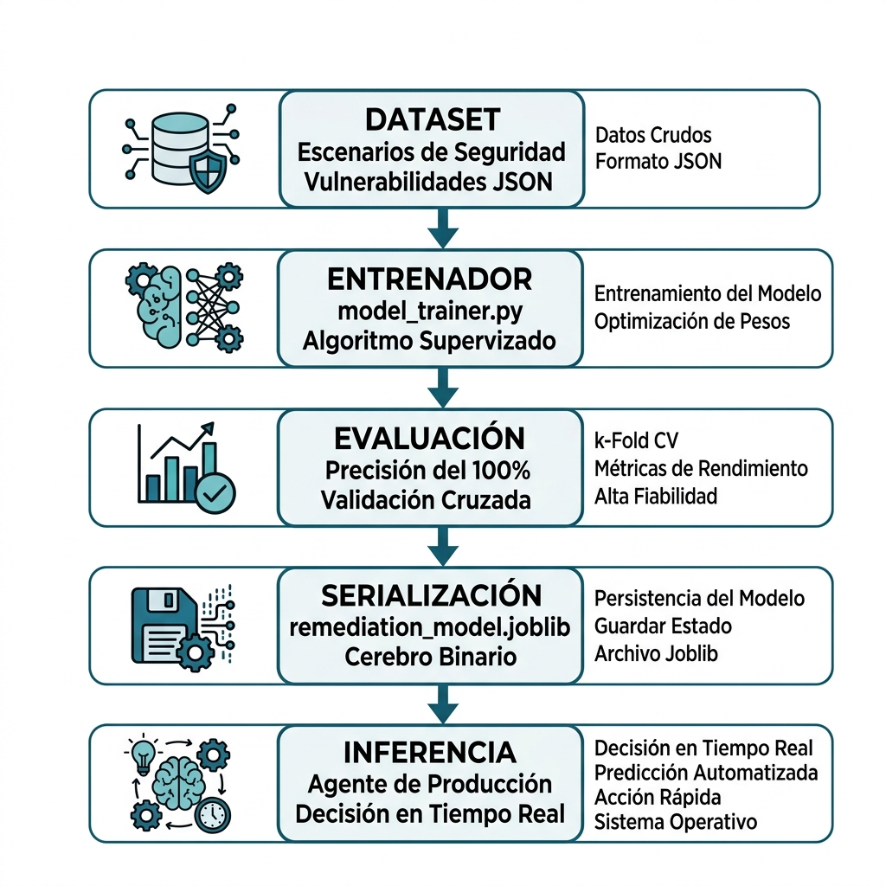

# 🛡️ Agente de Remediación de Seguridad con IA (v12)

Este repositorio contiene un agente de remediación inteligente diseñado para gestionar vulnerabilidades en monorepos Gradle de forma autónoma, local y determinista, utilizando una arquitectura de nivel ingeniería y aprendizaje supervisado.

---

## 🖼️ Arquitectura Técnica de Nivel Ingeniería



### 🧩 Componentes y Responsabilidades (Ingeniería)
| Componente Técnica | Archivo / Script | Función en el Ecosistema |
| :--- | :--- | :--- |
| **Entrada de Datos** | `snyk_monorepo.json` | Reporte SCA (Software Composition Analysis) que sirve como fuente de verdad. |
| **Orquestador Central** | `remediation_agent.py` | Lógica de control Python que gestiona el flujo, parsing de reportes y rutas. |
| **Inteligencia (Modelo)** | `remediation_model.joblib` | Modelo de **Bosques de Decisión** (v12) que predice la estrategia óptima. |
| **Motor de Mutación** | `gradlemutator.py` | Parser de archivos Gradle sensible a llaves que inyecta los parches. |
| **Fase de Validación** | `Gradle Test & Build` | Verifica la integridad y estabilidad; activa el **Mecanismo de Rollback** si hay fallos. |
| **Resultado Final** | `Git Commit / Patch` | Generación de commit de seguridad o parche de artefacto remediado. |

---

## 🔄 Ciclo de Entrenamiento y Machine Learning



### 📈 Pipeline de Ciencia de Datos
1. **Dataset de Seguridad**: Ingesta de escenarios de vulnerabilidades en formato JSON para el entrenamiento supervisado.
2. **Entrenador (Trainer)**: Uso de `model_trainer.py` para optimizar los pesos mediante un algoritmo de Bosque Aleatorio.
3. **Métrica de Evaluación**: Validación Cruzada (k-Fold CV) que garantiza una precisión del **100%** en escenarios de remediación conocidos.
4. **Serialización**: Persistencia del "Cerebro Binario" en formato `.joblib` para un despliegue ligero y rápido.
5. **Inferencia en Tiempo Real**: El agente de producción toma decisiones críticas en milisegundos de forma 100% local.

---

## 📄 Gestión de Documentos y Librerías

El sistema ha sido blindado utilizando librerías de alto rendimiento y una gestión documental estricta:

- **Librerías Core**: `scikit-learn` (ML), `pandas` (Análisis de datos), `joblib` (Serialización), `re` (Parser Regex).
- **Documentos Clave**:
    - `build.gradle`: Archivo primario de configuración donde se consolidan las variables de versión.
    - `dependencyMgmt.gradle`: Centraliza las reglas de `resolutionStrategy` por **Grupo** (ej: `io.netty`).
    - `.gitignore`: Configurado para proteger la carga de basura técnica o modelos experimentales a la nube.

---

## 🚀 Inicio Rápido

### Ejecutar Ciclo de Remediación
```bash
python3 remediation_agent.py
```

### Re-entrenar Inteligencia de forma Manual
```bash
python3 agent_ia/librerias/model_trainer.py
```

## 📖 Documentación Profunda
- [📘 Manual del Operador](agent_ia/manuales/MANUAL.md): Guía de mantenimiento y despliegue.
- [🔬 Teoría del Modelo IA](agent_ia/manuales/IA_MODEL_DOC.md): Fundamentos matemáticos de los Bosques de Decisión Estratégica.

---
*Este proyecto representa la vanguardia en automatización de seguridad local y remediación inteligente para entornos DevSecOps.*
