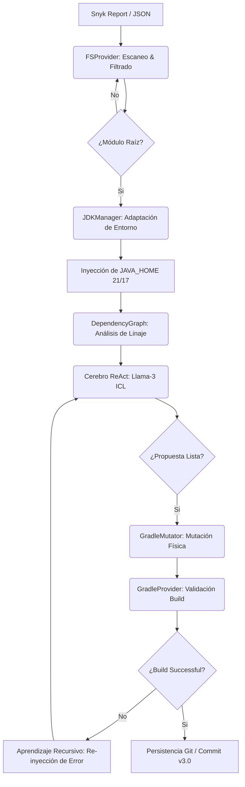
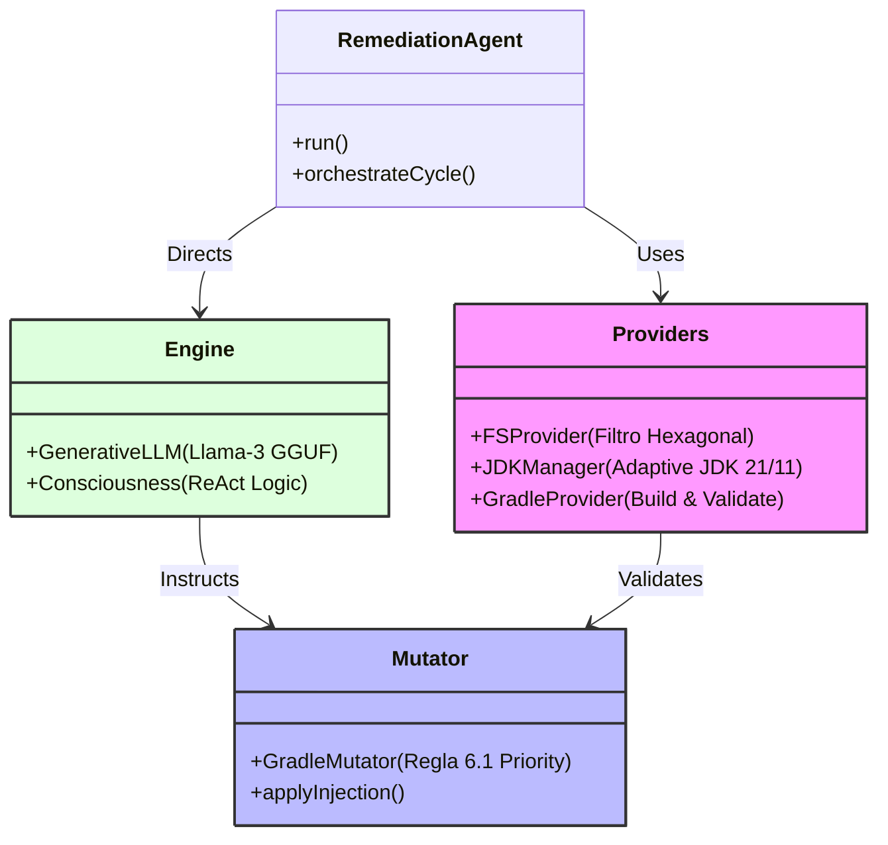

# 🛡️ Agente de Seguridad SCA: v.3.0 "Adaptive Intelligence"

Bienvenido a la **Versión 3.0** del Agente de Remediación. Este sistema ha evolucionado hacia un modelo de **Inteligencia Adaptativa**, capaz de diagnosticar y ajustarse automáticamente a las restricciones de tu entorno físico (JDK, arquitectura multi-módulo) para garantizar remediaciones exitosas.

## 🚀 ¿Qué hay de nuevo en la v.3.0?

A diferencia de las versiones anteriores, la v.3.0 integra **Resiliencia Física y Aprendizaje de Entorno**.

*   **Adaptive JDK Discovery**: Detecta automáticamente versiones compatibles de Java (JDK 21/17) para evitar errores de runtime, ignorando versiones incompatibles del sistema.
*   **Filtrado Inteligente de Monorepo**: Discrimina automáticamente entre microservicios reales y sub-módulos (api, usecase, domain), evitando procesos innecesarios en componentes internos.
*   **Prioridad de Mutación Crítica**: Centraliza las variables `ext` en `build.gradle` (prioritario) sobre `main.gradle`, manteniendo el estándar de arquitectura limpia.
*   **Auto-Sanación de Infraestructura**: Reconstruye dependencias de soporte y cura vínculos de configuración de forma quirúrgica.

### 🧠 El Ciclo Adaptive ReAct
El agente opera mediante un flujo coordinado entre sus componentes:

1.  **DESCUBRIMIENTO** (`providers.py`): `FSProvider` escanea el entorno excluyendo sub-directorios técnicos.
2.  **ADAPTACIÓN** (`providers.py`): `JDKManager` inyecta el entorno Java óptimo para Gradle.
3.  **PENSAMIENTO** (`consciousness.py`): Analiza la vulnerabilidad (CVE) y decide la estrategia.
4.  **MUTACIÓN** (`mutator.py`): `GradleMutator` aplica el cambio físico en los archivos `.gradle`.
5.  **VALIDACIÓN** (`providers.py`): `GradleProvider` certifica el éxito del build antes de confirmar.

*Evolución v.3.0: Desde el descubrimiento adaptativo hasta la auto-corrección certificada.*

### 🛠️ Desglose del Ciclo Adaptive ReAct (Técnico)

## 🛡️ Garantía de Privacidad
> [!IMPORTANT]
> **Es un sistema 100% privado y desconectado.** 
> - **Sin Internet**: Operación local absoluta.
> - **Tu código se queda en casa**: Ningún dato sale de tu entorno.
> - **Cerebro Local**: Inferencia mediante modelos GGUF optimizados.

## 🛠️ Arquitectura de Componentes
El agente es un ecosistema de clases especializadas trabajando en armonía:

*Arquitectura 3.0: Adaptabilidad por diseño e integración profunda con Gradle.*

### 📂 Mapa de Componentes y Archivos

- **`remediation_agent.py`**: El orquestador maestro que coordina el ciclo de vida.
- **`providers.py`**: Inteligencia ambiental (Gestión de JDK, Archivos y Gradle).
- **`mutator.py`**: El motor físico de cambio. Implementa las "Leyes de Inyección".
- **`consciousness.py`**: El bucle de razonamiento que aprende de los errores de compilación.

## 📋 Requisitos de Entorno
- **Python 3.10+**
- **Java 21/17**: El agente descubrirá automáticamente estas versiones en tu equipo.
- **Git**: Requerido para la persistencia de remediaciones mediante el flag `-c`.

## 🖱️ Guía de Ejecución Rápida

| Caso de Uso | Comando Sugerido | Descripción |
| :--- | :--- | :--- |
| **Fix Global v.3.0** | `python3 remediation_agent.py` | Remedia todo el monorepo con lógica adaptativa. |
| **Commit Certificado** | `python3 remediation_agent.py -c` | Persiste en Git solo si el build es exitoso. |
| **Foco Específico** | `python3 remediation_agent.py -f ms-auth` | Prioriza un microservicio específico. |
| **Modo Transparente** | `python3 remediation_agent.py --debug` | Muestra la salida real de Gradle y el pensamiento de la IA. |

## 📚 Documentación Maestra
1.  👉 **[Rulebook v.3.0](agent_ia/docs/remediation_rules.md)**: Estándares de inyección y prioridad de archivos.
2.  👉 **[Technical Manual](agent_ia/docs/manuals/TECHNICAL_MANUAL.md)**: Guía profunda sobre la arquitectura adaptativa.

---
*Protección Generativa para Microservices. Inteligencia v.3.0 Local y Privada.*
