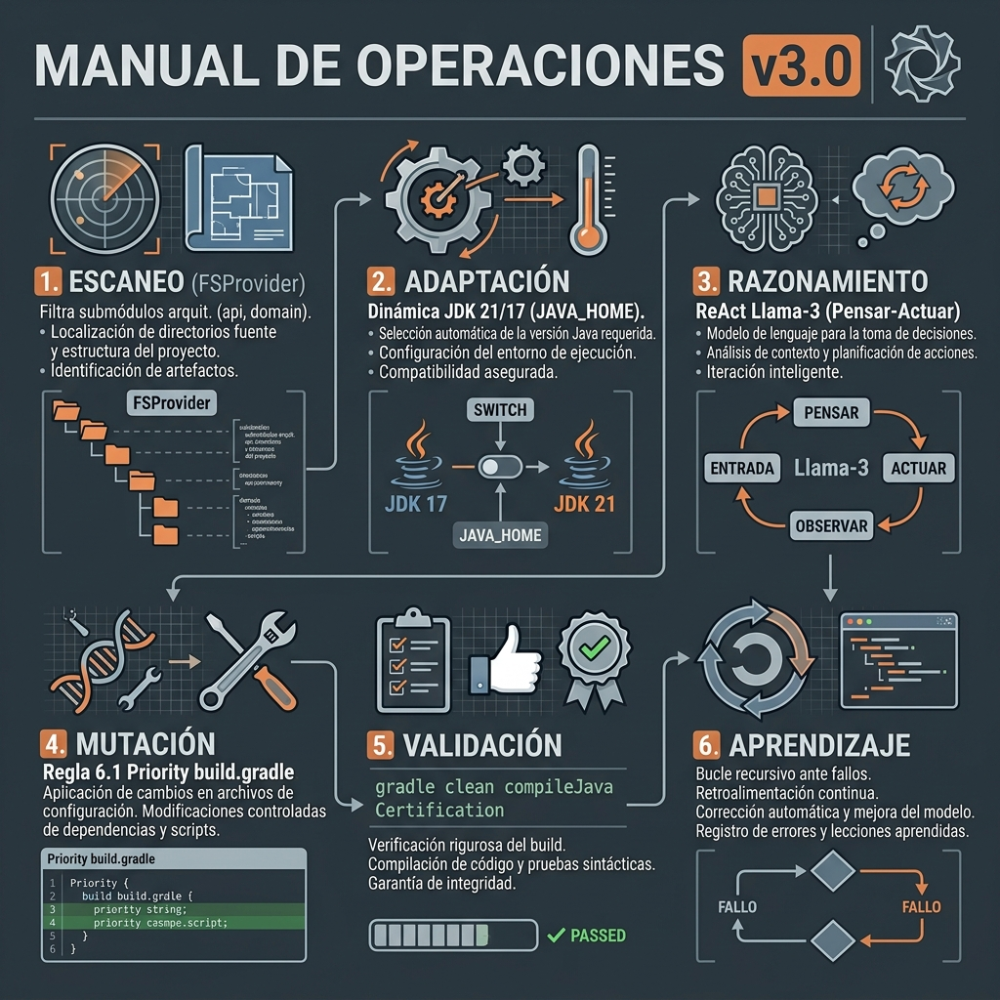
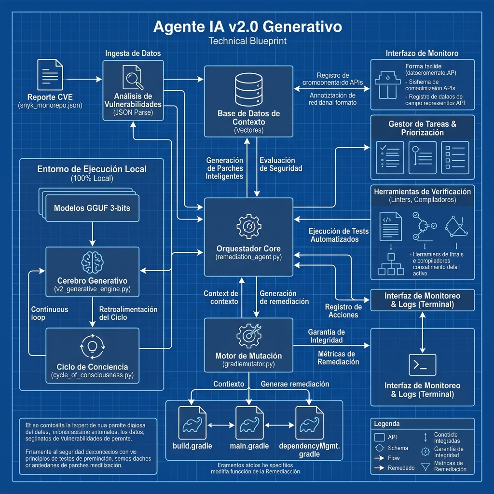

# 🛡️ Agente de Seguridad SCA: v2.0 (Edición Generativa)

Bienvenido a la **Versión 2.0** del Agente de Remediación. Este sistema ha evolucionado de un modelo predictivo tradicional a un ecosistema de **Inteligencia Artificial Generativa Autónoma**.

## 🚀 ¿Qué hay de nuevo en la v2.0?

A diferencia de las versiones anteriores, la v2.0 utiliza un **Cerebro Generativo (LLM)** que permite al agente razonar antes de actuar.

*   **Razonamiento Autónomo**: El agente sigue un ciclo lógico de pensamiento crítico (ReAct).
*   **Auto-Sanación Estructural**: Capacidad de reconstruir la infraestructura de seguridad de un proyecto desde cero.
*   **Integración Git Profesional (v2.0)**: Creación de ramas y commits automáticos de alta calidad basados en el éxito de la remediación.
*   **Portabilidad Robusta**: Autodescubrimiento de Gradle y soporte para entornos restringidos.

### 🧠 El Marco ReAct (Reason + Act)
El agente sigue un ciclo lógico:
1.  **PENSAMIENTO**: Analiza la vulnerabilidad (CVE) y determina agrupaciones por familias.
2.  **ACCIÓN**: Define el cambio de código y la creación de infraestructura necesaria.
3.  **EXPLICACIÓN**: Justifica técnicamente la remediación siguiendo el **Estándar de Trinomio**.


*Visualización del Ciclo de Conciencia v2.0: Desde la detección hasta la auto-corrección.*

## 🛡️ Garantía de Privacidad: Tu código NO sale de tu equipo
> [!IMPORTANT]
> **Es un sistema 100% privado y desconectado.** 
> - **Sin Internet**: Operación local absoluta.
> - **Tu código se queda en casa**: Ningún dato sale de tu entorno.
> - **Cerebro Local**: Inferencia mediante modelos GGUF optimizados.

## 🛠️ Arquitectura Técnica
El agente opera como una colmena coordinada de componentes locales:


*Arquitectura Transparente: Privacidad por diseño e integración nativa con Gradle.*

- **Motor de Inferencia**: `llama-cpp-python` (Optimizado para modelos GGUF).
- **Mutación Estructural**: `GradleMutator` con capacidades de inyección y vinculación dinámica.
- **Auto-Purge**: Limpieza automática de variables redundantes.

## 📋 Requisitos de Entorno
- **Python 3.10+** (Recomendado 3.11+)
- **Java 21 (LTS)**: El Agente requiere JDK 21 para validaciones de Gradle. Se prohíbe JDK 25 por incompatibilidades con Lombok.
- **Git**: Instalado y configurado en el PATH.
- `pip install -r agent_ia/requirements.txt`
- Modelo GGUF en `agent_ia/models/` (Recomendado: 4-6GB RAM libres).

## 🖱️ Guía de Ejecución Rápida
El Agente es flexible y permite operar en modo "Solo Lectura/Escritura Local" o en modo "Persistencia Git". Selecciona la combinación que mejor se adapte a tu flujo de trabajo:

### 🎮 Combinaciones de Comandos

| Caso de Uso | Comando Sugerido | Descripción |
| :--- | :--- | :--- |
| **Fix Local (Dry-Run)** | `python3 remediation_agent.py` | Modifica los archivos físicamente pero **NO crea ramas ni commits**. Útil para inspección manual previa. |
| **Remediación Total Segura** | `python3 remediation_agent.py -c` | El estándar de producción. Aplica cambios, valida y **crea rama/commit** solo si el build es exitoso. |
| **Foco en Microservicio** | `python3 remediation_agent.py -f ms-auth -c` | Ejecuta la inteligencia solo en la carpeta especificada y persiste resultados validados en Git. |
| **Diagnóstico & Debug** | `python3 remediation_agent.py --debug -f ms-clients` | Habilita la salida detallada de Gradle en tiempo real para entender por qué falla un test. |
| **Entorno Personalizado** | `python3 remediation_agent.py --gradle-path /usr/bin/gradle -c` | Fuerza el uso de una instalación específica de Gradle en entornos donde no existe el `gradlew`. |
| **Reporte Externo** | `python3 remediation_agent.py --report scanning_report.json` | Ejecuta el ciclo de remediación basándose en un archivo JSON específico de vulnerabilidades. |

### 🛡️ Lógica de Persistencia `--commit`
Es importante entender que el Agente prioriza la integridad del monorepo:
1. **Sin el flag `--commit`**: El agente es destructivo localmente (modifica archivos) pero **conservador en Git**.
2. **Con el flag `--commit`**: El agente garantiza que **CADA commit es un BUILD SUCCESSFUL**. Si la validación falla, se realiza un rollback automático y Git permanece limpio.

## 🔍 Monitoreo y Depuración (Modo Debug)
Si el proceso de validación (`gradle clean test`) toma mucho tiempo y deseas ver qué está ocurriendo, puedes activar el **Modo Debug** para habilitar la salida detallada de Gradle en tiempo real.

### Via Flag CLI:
```bash
python3 remediation_agent.py --debug
```

### Combinando Flags:
```bash
python3 remediation_agent.py -f ms-clients --debug
```

## ✨ Últimas Innovaciones v2.0

### 🧩 Almacenamiento de Dependencias Híbrido
A diferencia de versiones anteriores que delegaban todo a la centralización, la **v2.0** utiliza ahora un enfoque híbrido:
- **Centralización Directa**: Mantiene las reglas de resolución en `dependencyMgmt.gradle`.
- **Preservación Local**: Las líneas `implementation` en cada `build.gradle` se mantienen, pero se sustituyen automáticamente por variables (ej. `implementation "group:artifact:${varName}"`), garantizando que el microservicio siga siendo autodocumentado.

## 📚 Gobernanza y Documentación
Para profundizar en la arquitectura y operación del Agente, consulta los manuales maestros:

1.  👉 **[Master Remediation Rulebook v2.0](agent_ia/docs/remediation_rules.md)**: Estándares técnicos, leyes de inyección y protocolos de Git.
2.  👉 **[Technical & Operator Manual](agent_ia/docs/manuals/TECHNICAL_MANUAL.md)**: Teoría de la IA Autónoma, facultades del Agente, flujos de ejecución y resolución de problemas.

### 🏗️ Inyección de Configuración Robusta
El motor de mutación ha sido robustecido en esta versión para garantizar scripts Gradle válidos y limpios:
- **Indentación Estricta**: Cada bloque inyectado sigue un estándar de 8 espacios, eliminando el desorden visual.
- **Header dinámico**: Cada script de remediación comienza con metadatos claros para evitar errores de compilación (`Unexpected input`).
- **Seguridad de Parseo**: Evita la mezcla de bloques `if` en la misma línea, asegurando una estructura legible para humanos y máquinas.

---
*Protección Generativa para Microservices. Inteligencia v2.0 Local y Privada.*
