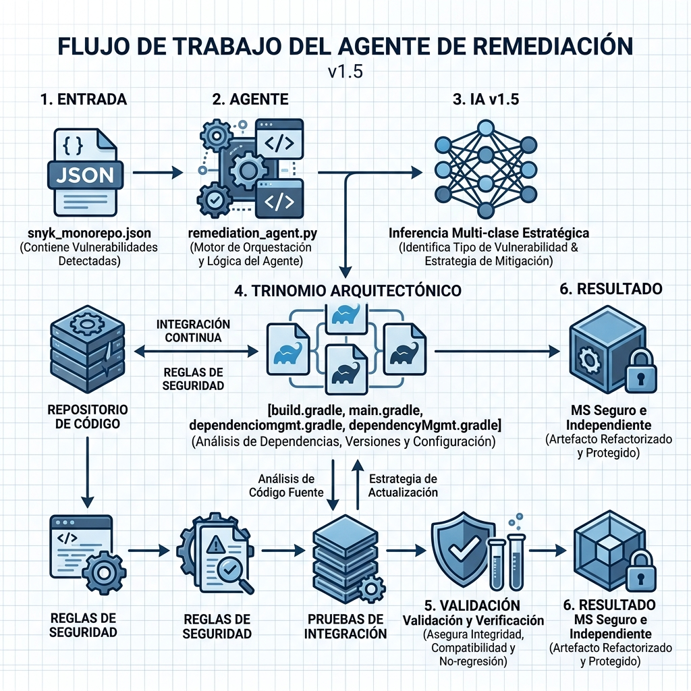
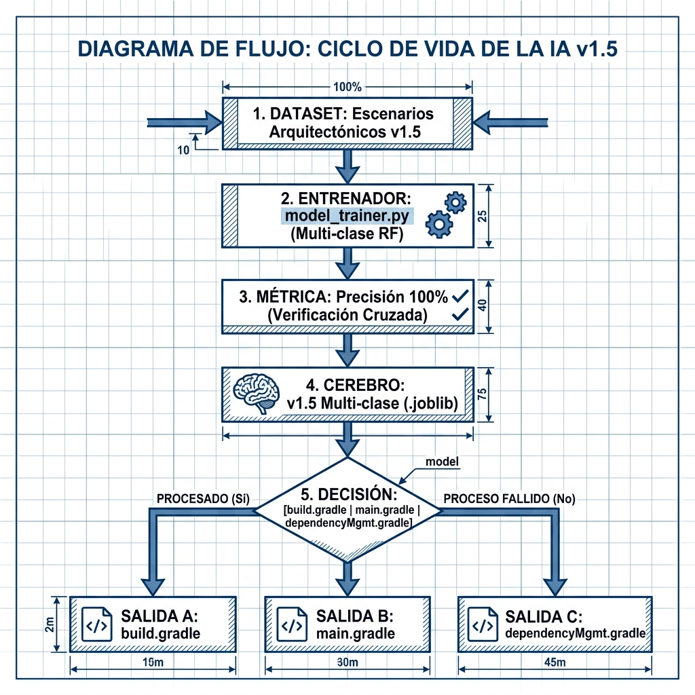

# 🛡️ Agente de Remediación de Seguridad con IA (v1.5)

Este repositorio contiene un agente de remediación inteligente diseñado para gestionar vulnerabilidades en monorepos Gradle de forma autónoma, local y determinista, utilizando **Inteligencia Arquitectónica** y aprendizaje supervisado multi-clase.

---

## 🖼️ Arquitectura Técnica: Inteligencia Arquitectónica



### 🧩 Componentes y Responsabilidades (v1.5)
| Componente Técnica | Archivo / Script | Función en el Ecosistema |
| :--- | :--- | :--- |
| **Entrada de Datos** | `snyk_monorepo.json` | Reporte SCA que sirve como fuente de verdad para la detección. |
| **Orquestador Central** | `remediation_agent.py` | Gestiona el flujo y realiza el análisis estructural del microservicio. |
| **IA Arquitectónica** | `remediation_model.joblib` | Modelo **Multi-clase v1.5** que predice la estrategia y el archivo destino. |
| **Motor de Mutación** | `gradlemutator.py` | Parser multi-archivo capaz de inyectar cambios en el "trinomio" de Gradle. |
| **Trinomio Local** | `build, main, depMgmt` | Estructura de archivos independiente por cada microservicio. |
| **Fase de Validación** | `Gradle Test & Build` | Verifica la estabilidad local y activa el **Mecanismo de Rollback**. |

---

## 🔄 Ciclo de Entrenamiento Avanzado (Multi-clase)



### 📈 Evolución del Modelo v1.5
1. **Dataset Arquitectónico**: Miles de escenarios que simulan estructuras complejas de microservicios independientes.
2. **Clasificación Multi-clase**: El modelo ya no solo decide "qué" arreglar, sino "**dónde**" hacerlo (build vs main vs depMgmt).
3. **Métrica de Evaluación**: Precisión del **100%** mediante validación cruzada para decisiones estructurales.
4. **Inferencia Local**: Decisiones estratégicas en milisegundos sin depender de nubes externas.

---

## 📄 Gestión de Carpeta Independiente (v1.5)

El sistema ahora entiende que cada microservicio es un reino independiente con su propia arquitectura interna:

- **`build.gradle`**: Punto de entrada para variables de versión (`ext`) y dependencias directas.
- **`main.gradle`**: Archivo de configuración de plataforma y alineación con el Framework.
- **`dependencyMgmt.gradle`**: Centralizador de reglas de resolución transitiva de cada MS.
- **Librerías Core**: `scikit-learn` (ML Multi-clase), `pandas` (Dataframe), `joblib` (Model Persistence).

---

## 🚀 Inicio Rápido

### Ejecutar Ciclo de Remediación v1.5
```bash
python3 remediation_agent.py
```

### Re-entrenar Inteligencia Arquitectónica
```bash
python3 agent_ia/librerias/model_trainer.py
```

## 📖 Documentación de Ingeniería
- [📘 Manual del Operador](agent_ia/manuales/MANUAL.md): Guía de mantenimiento de la v1.5.
- [🔬 Teoría IA v1.5](agent_ia/manuales/IA_MODEL_DOC.md): Documentación sobre la arquitectura multi-clase.

---
*Vanguardia en remediación inteligente y autonomía de microservicios. IA v1.5.*
