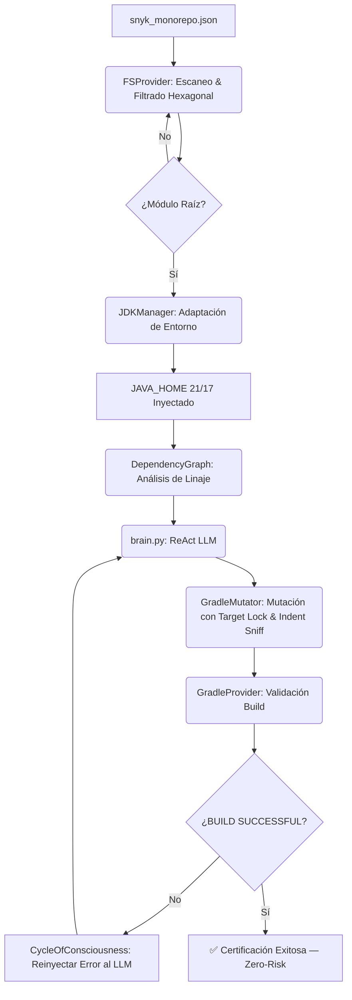

# 🛡️ Agente de Remediación de Seguridad SCA: v.3.0 "Adaptive Intelligence"

Bienvenido a la **Versión 3.0** del Agente de Remediación. Este sistema opera con **Inteligencia Adaptativa**, capaz de diagnosticar y ajustarse automáticamente a las restricciones del entorno físico (JDK, arquitectura multi-módulo) para garantizar remediaciones exitosas sin intervención humana.

---

## 🚀 ¿Qué hay de nuevo en la v.3.0?

| Capacidad | Descripción |
| :--- | :--- |
| **Adaptive JDK Discovery** | Detecta automáticamente JDK 21/17, ignorando versiones incompatibles. |
| **Ley de Profundidad Hexagonal** | Discrimina microservicios raíz de sub-módulos por profundidad de ruta. |
| **Inyección Seamless (Indent Sniffing)** | Detecta y replica la indentación del bloque `ext` existente. |
| **Zero-Watermark Policy** | Archivos generados 100% limpios, sin marcas de agente. |
| **Target Locking** | Solo `build.gradle` raíz puede declarar variables globales. |
| **Inyección Pura de Infraestructura** | El `allprojects { }` se respeta y anida limpiamente. |
| **Rollback Zero-Risk** | Restauración automática ante cualquier fallo de compilación. |

---

## 🧠 Arquitectura Consolidada (v.3.0 Refactored)

La v.3.0 opera con **4 módulos Python** en lugar de los 14 archivos dispersos de versiones anteriores.

```
15 archivos → 4 módulos
```

```
remediation_agent.py               ← Orquestador CLI
agent_ia/
  core/__init__.py                  ← Motor físico completo (11 clases)
  brain.py                          ← Cerebro ReAct LLM
  scripts/run_master_certification.py ← Suite QA (7 escenarios)
  data/cve/snyk_monorepo.json       ← Base de datos de vulnerabilidades
  docs/remediation_rules.md         ← Rulebook oficial v.3.0
```

### 🔌 Clases en `agent_ia/core/`

| Clase | Responsabilidad |
| :--- | :--- |
| `Vulnerability` | Modelo de datos para CVEs/GHSAs |
| `JDKManager` | Selección adaptativa de Java 21/17 |
| `FSProvider` | Escaneo de monorepo, filtrado hexagonal |
| `GradleProvider` | Descubrimiento de Gradle y validación de builds |
| `GitProvider` | Commits de seguridad automáticos |
| `DependencyGraph` | Análisis de linaje de dependencias transitivas |
| `InfrastructureHealer` | Auto-sanación de `dependencyMgmt.gradle` (Regla 6) |
| `VariableManager` | Inyección en bloques `ext` con Indent Sniffing |
| `RuleInjector` | Inyección de reglas transitivas en `dependencyMgmt.gradle` |
| `GradleMutator` | Fachada coordinada de mutación física |
| `CycleOfConsciousness` | Bucle ReAct: Generar → Aplicar → Validar → Aprender |

---

## 🔄 El Ciclo Adaptive ReAct



---

## 🛡️ Garantía de Privacidad

> [!IMPORTANT]
> **Es un sistema 100% local y desconectado.**
> - **Sin Internet**: Operación completamente offline.
> - **Tu código se queda en casa**: Ningún dato sale de tu entorno.
> - **Cerebro Local**: Inferencia mediante reglas ReAct hard-coded (extensible con modelos GGUF locales).

---

## 🖱️ Guía de Ejecución Rápida

| Caso de Uso | Comando |
| :--- | :--- |
| **Remediación global** | `python3 remediation_agent.py` |
| **Foco en microservicio** | `python3 remediation_agent.py --folders ms-sales` |
| **Múltiples servicios** | `python3 remediation_agent.py --folders ms-auth ms-sales` |
| **Modo debug** | `python3 remediation_agent.py --debug` |
| **Certificación QA** | `python3 agent_ia/scripts/run_master_certification.py` |

---

## ✅ Suite de Certificación Maestra (7 Escenarios)

El agente incluye una suite de pruebas automática que valida todas las reglas físicas:

| Test | Qué valida |
| :--- | :--- |
| `cert_rule_6_sync` | Auto-Heal y vinculación de infraestructura |
| `cert_rule_3_3_audit` | Reemplazo limpio + cumplimiento Zero-Watermark |
| `cert_hexagonal_depth` | Inyección exclusiva en raíz, submódulos intactos |
| `cert_seamless_buildscript` | Alineación visual perfecta en bloques `buildscript` |
| `cert_multi_project_orchestration` | Orquestación de múltiples microservicios |
| `cert_cli_interface` | Flags `--folders` y `--debug` |
| `cert_rule_4_adaptive_intel` | Override de versión por el Cerebro IA |

---

## 📚 Documentación

- 👉 **[Rulebook v.3.0](agent_ia/docs/remediation_rules.md)**: Leyes de inyección, familias y prioridades.

---
*Agente de Remediación Generativa v.3.0 — Local, Privado y Certificado.*
