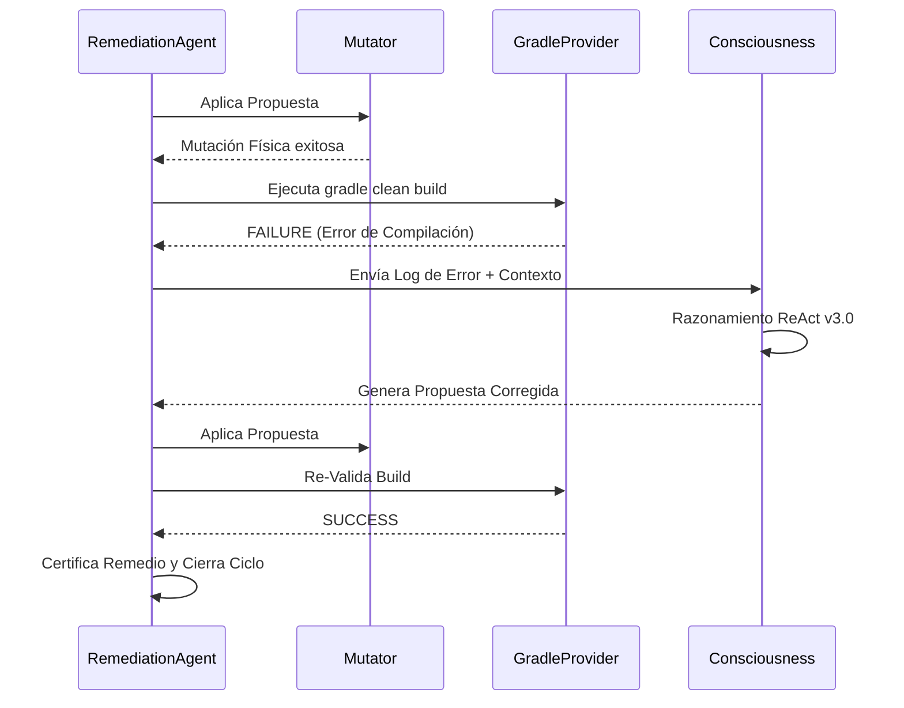

# Manual Técnico y de Operación: Agente IA v.3.0 Adaptive

Este documento constituye la fuente única de verdad para entender la ingeniería de entorno, las facultades autónomas y la operación práctica del Agente v.3.0.

---

## 1. Ingeniería de Entorno Adaptativo

A diferencia de versiones anteriores, la v.3.0 no depende de una configuración estática del sistema. El agente ahora cuestiona y ajusta su propio entorno de ejecución.

### 🧩 Gestión de JDK (JDKManager)
Ubicación: `agent_ia/core/providers.py`
El componente `JDKManager` realiza un descubrimiento autónomo de binarios de Java en el equipo del usuario. 
- **Lógica de Selección**: Prioriza JDK 21 o 17 sobre versiones más recientes (como JDK 25) si detecta que estas últimas causan errores de inicialización en Gradle (`ExceptionInInitializerError`).
- **Inyección Dinámica**: El `JAVA_HOME` detectado se inyecta en cada proceso de Gradle y en la construcción del grafo de dependencias para garantizar consistencia absoluta.

### 📂 Filtrado de Microservicios (FSProvider)
Ubicación: `agent_ia/core/providers.py`
Para optimizar la remediación en monorepos complejos o arquitecturas hexagonales, el `FSProvider` implementa una lista de exclusión inteligente.
- **Exclusión de Sub-módulos**: Filtra carpetas como `api`, `usecase`, `domain`, `infrastructure`, `src` y `bin`.
- **Foco en Raíz**: Solo identifica como microservicios aquellos directorios que contienen un `build.gradle` y actúan como puntos de entrada compilables.

---

## 2. Arquitectura de Pensamiento ReAct 3.0

### El Bucle de Consciencia (`consciousness.py`)
El agente ha evolucionado su marco deductivo:
1.  **Razonamiento Profundo**: El agente utiliza metadatos de linaje (`graph.py`) para entender si una vulnerabilidad es directa o transitiva.
2.  **Aprendizaje de Error**: Si el primer intento de remediación falla (ej. incompatibilidad de versiones), el log de error de Gradle se re-inyecta al modelo para generar una segunda propuesta más precisa.
3.  **Trazabilidad Jerárquica**: Los logs ahora reflejan visualmente esta jerarquía, permitiendo auditar el "Pensamiento" de la IA en cada sub-proceso.

---

## 3. Motor de Mutación y Leyes de Inyección

### `GradleMutator.py`
El motor físico aplica cambios siguiendo reglas de seguridad industrial:
- **Regla de Prioridad 6.1**: El agente siempre buscará y aplicará la inyección de variables `ext` en `build.gradle` (estándar de Spring Boot). Si no existe, recurrirá a `main.gradle`.
- **Blindaje de Interpolación**: Todas las variables inyectadas utilizan comillas dobles (`"..."`) para permitir la interpolación de Groovy, evitando errores de sintaxis comunes en remediaciones manuales.

### 📋 Matriz de Responsabilidades Técnicas (v.3.0)

El sistema opera bajo un contrato de responsabilidades atómicas para garantizar el "Zero-Risk":

| Componente | Archivo | Responsabilidad Principal | Regla Maestra |
| :--- | :--- | :--- | :--- |
| **Orquestador** | `remediation_agent.py` | Control de flujo y coordinación general. | Zero-Risk |
| **JDKManager** | `providers.py` | Detección de JDK 21/17 y export de JAVA_HOME. | Adaptive Runtime |
| **FSProvider** | `providers.py` | Filtrado hexagonal de sub-módulos (api/domain/etc). | Target Root Only |
| **Mutator** | `mutator.py` | Escritura quirúrgica y prioridad de archivos. | Rule 6.1 (build.gradle) |
| **Consciousness** | `consciousness.py` | Re-inyección de errores y razonamiento ReAct. | Self-Healing Loop |

### 🔄 Flujo de Autocorrección (Self-Healing)

---

## 4. Resolución de Problemas e Infraestructura

### Fallos Comunes y Diagnóstico
- **`INFRA_ERROR`**: El agente abortará si no detecta un entorno Java compatible o si Gradle no está disponible.
- **Rollback Automático**: Si una mutación causa un fallo de compilación tras 3 intentos, el agente restaura el estado original del microservicio para mantener la integridad del repositorio.

---
*Manual Maestro Unificado v.3.0 Adaptive.*
